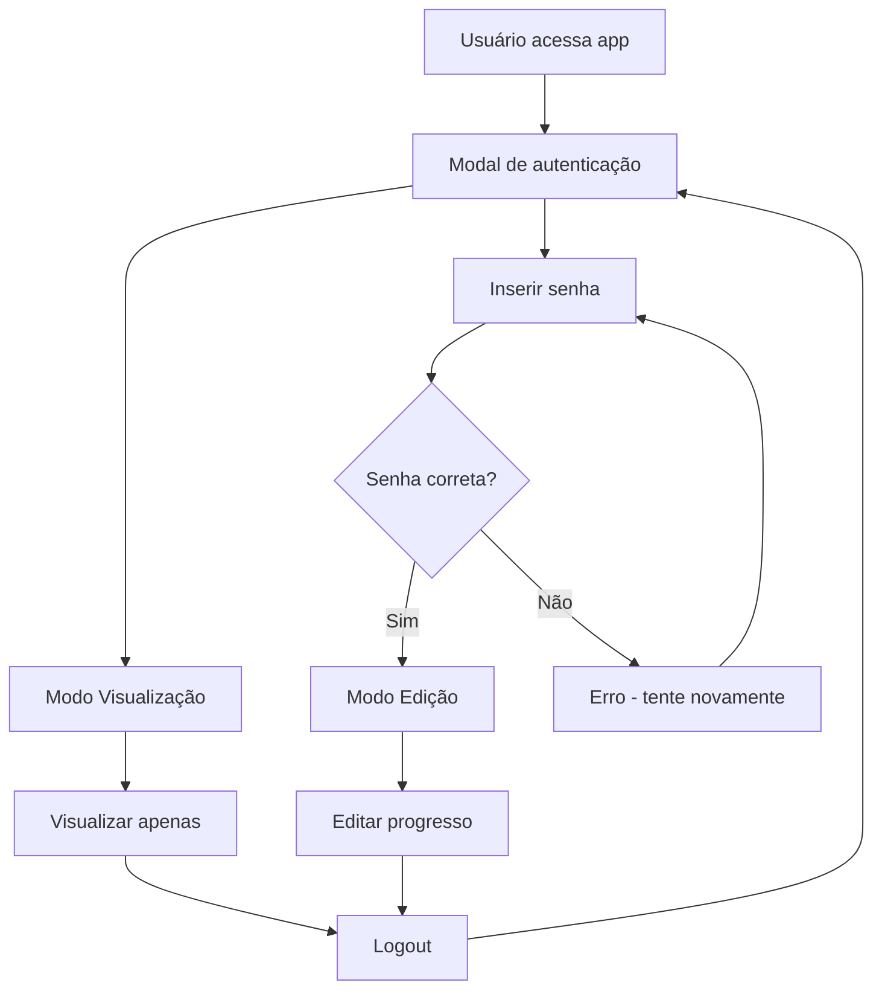

# 🔐 Sistema de Autenticação - Jornada da Liberdade

Sistema de autenticação simples com dois modos de acesso: **Visualização** e **Edição**.

## 🎯 **Como Funciona**

### **👁️ Modo Visualização**
- **Acesso:** Livre (sem senha)
- **Funcionalidades:**
  - ✅ Ver todo o progresso da jornada
  - ✅ Visualizar dias concluídos e pendentes
  - ✅ Acessar estatísticas e relatórios
  - ❌ **NÃO pode** marcar dias como concluídos
  - ❌ **NÃO pode** editar reflexões

### **✏️ Modo Edição**
- **Acesso:** Requer senha
- **Funcionalidades:**
  - ✅ Todas as funções do modo visualização
  - ✅ **PODE** marcar dias como concluídos
  - ✅ **PODE** adicionar/editar reflexões
  - ✅ **PODE** definir níveis de dificuldade

## 🔧 **Configuração**

### **1. Definir Senha**
No arquivo `.env`:
```env
NEXT_PUBLIC_EDIT_PASSWORD="sua_senha_aqui"
```

**Padrão:** `liberdade2025`

### **2. Segurança**
- ✅ Sessão expira em **24 horas**
- ✅ Senha armazenada apenas no ambiente
- ✅ Estado salvo no `localStorage`
- ✅ Botão de logout disponível

## 🚀 **Usando o Sistema**

### **Primeira Visita**
1. Usuário acessa a aplicação
2. Modal de autenticação aparece
3. **Opções:**
   - **"Modo Visualização"** → Acesso imediato
   - **"Modo Edição"** → Inserir senha

### **Modo Visualização**
- Cards dos dias mostram overlay ao passar mouse
- Legenda indica "Visualização apenas"
- Botão de logout no canto superior direito

### **Modo Edição**
- Cards dos dias são clicáveis normalmente
- Legenda indica "Clique nos dias para marcar"
- Indicador verde no canto superior direito

### **Trocar de Modo**
1. Clicar no botão de logout (🚪)
2. Modal de autenticação reaparece
3. Escolher novo modo

## 🎨 **Interface Visual**

### **Indicadores de Modo**
```jsx
// Canto superior direito
🟢 ✏️ Edição     // Modo edição ativo
🔵 👁️ Visualização // Modo visualização ativo
```

### **Estados dos Cards**
```jsx
// Modo Visualização
- Cursor: default
- Hover: mostra "👁️ Modo Visualização"
- Clique: sem ação

// Modo Edição  
- Cursor: pointer
- Hover: efeitos normais
- Clique: abre modal de reflexão
```

## 🔒 **Fluxo de Autenticação**



## 🛡️ **Segurança**

### **Nível de Proteção**
- **Baixo/Médio:** Para uso pessoal/familiar
- **NÃO recomendado** para dados ultra-sensíveis
- Senha visível no código-fonte do frontend

### **Melhorias Possíveis**
Para maior segurança, considere:
1. **Backend authentication** com JWT
2. **Hash da senha** no servidor
3. **Rate limiting** para tentativas
4. **2FA** (two-factor authentication)

## 📱 **Responsividade**

- ✅ Funciona em desktop e mobile
- ✅ Modal responsivo
- ✅ Indicadores adaptam ao tamanho da tela
- ✅ Overlay dos cards otimizado para touch

## 🔧 **Desenvolvimento**

### **Componentes Criados**
```
src/app/
├── contexts/AuthContext.js      # Gerenciamento de estado
├── components/
│   ├── AuthModal.jsx           # Modal de login
│   └── AuthIndicator.jsx       # Indicador de modo ativo
```

### **Hooks Disponíveis**
```javascript
const { 
  isEditMode,      // boolean - se está em modo edição
  isAuthenticated, // boolean - se está autenticado
  login,          // function - fazer login com senha
  logout,         // function - fazer logout
  enterViewMode   // function - entrar em modo visualização
} = useAuth();
```

## 📊 **Estatísticas de Uso**

O sistema salva no localStorage:
```json
{
  "jornada-auth": {
    "timestamp": 1698765432000,
    "mode": "edit" // ou "view"
  }
}
```

## 🎯 **Casos de Uso**

### **Uso Pessoal**
- Modo visualização para familiares
- Modo edição apenas para o dono da jornada

### **Uso Compartilhado**
- Link público em modo visualização
- Senha privada para edição

### **Demonstrações**
- Mostrar progresso sem risco de alterações acidentais
- Apresentações e portfólio

---

## ✨ **Pronto para Usar!**

O sistema está completamente funcional e integrado. Basta:

1. **Definir sua senha** no `.env`
2. **Testar ambos os modos**
3. **Compartilhar** o link conforme necessário!

🚀 **Sua jornada agora tem proteção e flexibilidade!**